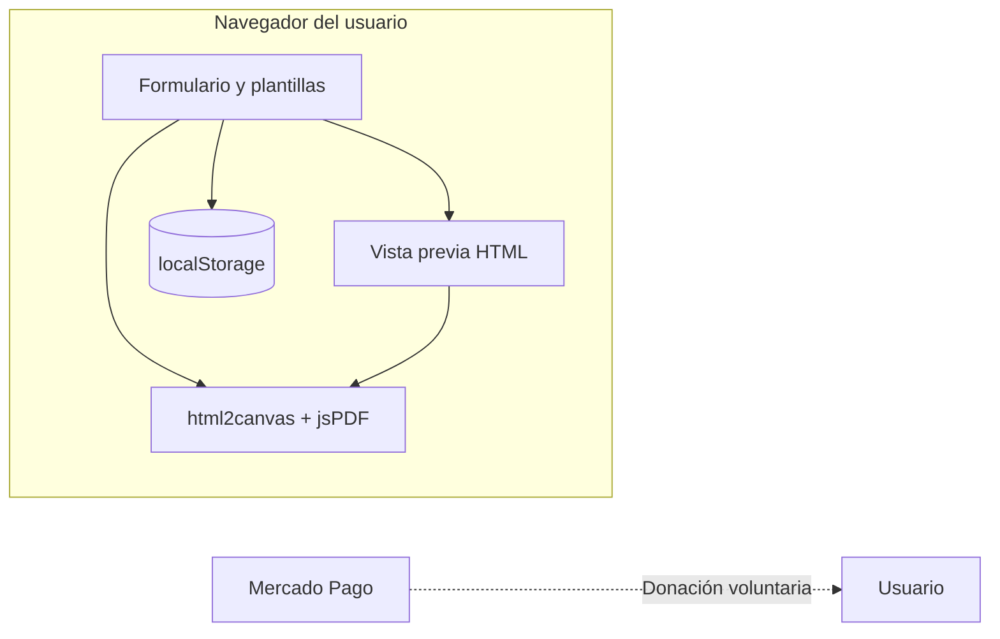

# Documentación de entrega — CV Studio

**Proyecto final (plantilla)**  
Sustituye los campos entre corchetes antes de entregar: `[Tu nombre]`, `[Institución]`, `[Asignatura]`, `[Fecha]`.

---

## 1. Datos de la entrega

| Campo | Valor |
|--------|--------|
| **Título** | CV Studio — Generador de currículum en PDF |
| **Autor(es)** | [Tu nombre] |
| **Institución** | [Nombre de la institución] |
| **Asignatura** | [Nombre de la asignatura] |
| **Fecha** | [Fecha de entrega] |
| **Repositorio / URL** | [Enlace a GitHub Pages, Netlify o ZIP] |

---

## 2. Resumen ejecutivo (para el profesor)

**CV Studio** es una aplicación web **estática** (HTML, CSS, JavaScript) que permite rellenar un formulario con datos profesionales, elegir entre **tres plantillas visuales** (Editorial, Corporativo, Minimal), previsualizar el resultado y **exportar un PDF multipágina** generado en el cliente con **html2canvas** y **jsPDF**.

Incluye persistencia local (**localStorage**), validación de campos, **banners de publicidad simulada** (solo en la web), **donación voluntaria** enlazada a **Mercado Pago** (sin desbloqueo en cliente ni servidor en esta versión) y generación de texto de perfil con **OpenAI** (opcional, con clave del usuario).

---

## 3. Objetivos del proyecto (ejemplo; ajústalos a tu rúbrica)

1. Diseñar una interfaz usable y **responsive** para la captura de datos de un CV.
2. Implementar **tres diseños** distintos de currículum con HTML y estilos **inline** compatibles con la captura a imagen/PDF.
3. Generar **PDF en formato A4**, con **varias páginas** si el contenido es largo, manteniendo proporción sin recortar texto por error de scroll.
4. Aplicar **validación** en el cliente (nombre, correo, experiencia obligatorios).
5. Integrar **persistencia** (borrador) y un modelo de **apoyo** (anuncios simulados, donación externa opcional).
6. Documentar **limitaciones** (sin backend de pagos) y **líneas futuras** de mejora.

---

## 4. Stack tecnológico

| Capa | Tecnología |
|------|------------|
| Estructura y contenido | HTML5 semántico (`header`, `nav`, `main`, `section`, `footer`) |
| Presentación | CSS3 (Grid, Flexbox, variables implícitas en diseño, `clamp`, media queries) |
| Lógica | JavaScript (ES6+), sin framework |
| Iconos | Font Awesome 6 (CDN) |
| Tipografías | Google Fonts (DM Sans, Montserrat, Playfair Display, etc.) |
| PDF | [html2canvas](https://html2canvas.hertzen.com/) 1.4 + [jsPDF](https://github.com/parallax/jsPDF) 2.5 |
| IA (opcional) | API REST [OpenAI](https://platform.openai.com/docs/api-reference) desde el navegador (clave introducida por el usuario) |
| Despliegue | Sitio estático (GitHub Pages, Netlify, etc.) — ver `README.md` |

---

## 5. Arquitectura lógica



No hay **backend** en esta versión: los datos no se envían a un servidor del alumno salvo que el usuario use la API de OpenAI con su propia clave.

---

## 6. Funcionalidades implementadas (checklist)

- [x] Tres plantillas de CV con nombres descriptivos
- [x] Foto opcional y plantilla imagen opcional
- [x] Campos: datos personales, perfil, formación, experiencia, habilidades, idiomas, información adicional
- [x] Validación antes de generar vista / PDF
- [x] Vista previa y PDF multipágina
- [x] Guardar / cargar borrador (`localStorage`)
- [x] Cargar ejemplo demo
- [x] **Donación** opcional con enlace a Mercado Pago (apoyo; no activa funciones en el sitio)
- [x] Página legal de plantilla (`legal.html`) y `404.html`
- [x] Manifest y favicon para PWA ligera
- [x] Exportar / importar borrador en **JSON** (respaldo y portabilidad)
- [x] **Limpiar formulario** con confirmación
- [x] **Tema oscuro** (preferencia en `localStorage`)
- [x] **Anuncio accesible** al actualizar la vista previa (`aria-live`)
- [x] Revocación de **URLs blob** en la vista previa para evitar fugas de memoria

---

## 7. Limitaciones conocidas (honestidad académica)

1. **Donación**: el enlace abre Mercado Pago en otra pestaña; **no** hay backend que registre donaciones ni que desbloquee contenido. Es solo apoyo voluntario.
2. **OpenAI**: la clave viaja desde el navegador; en producción real conviene **proxy** en servidor para no exponer la clave.
3. **PDF**: depende de html2canvas; fuentes o iconos pueden variar levemente entre navegadores.
4. **Accesibilidad**: mejorable (auditoría completa WCAG no incluida por defecto).

Mencionar estas limitaciones en la **defensa oral** suele sumar puntos frente a ocultarlas.

---

## 8. Cómo ejecutar y probar (para el profesor)

```bash
npm start
```

Abrir la URL indicada (por ejemplo `http://localhost:3000`). Opcional: adjuntar **capturas** de pantalla del formulario, de cada plantilla y de un PDF de varias páginas en el informe en PDF/Word de la asignatura.

---

## 9. Ideas de mejora (si el profesor pregunta “¿qué harías después?”)

| Prioridad | Mejora |
|-----------|--------|
| Alta | Backend + webhooks si en el futuro quieres **planes de pago verificables** o registro de donaciones |
| Alta | Tests automatizados (p. ej. Vitest) para `validarFormulario` y `normalizarPlantillaGuardada` |
| Media | Internacionalización (i18n) español / inglés |
| Media | Exportar también a **.docx** o imprimir con `@media print` dedicado |
| Media | Modo oscuro en la app (el CV en PDF puede seguir claro para imprimir) |
| Baja | PWA offline con Service Worker y caché de assets |

---

## 10. Referencias y fuentes

- MDN Web Docs — HTML, CSS, JavaScript, `localStorage`  
- Documentación [html2canvas](https://html2canvas.hertzen.com/) y [jsPDF](https://github.com/parallax/jsPDF)  
- [Mercado Pago Developers](https://www.mercadopago.com.mx/developers/es/docs) — pagos y notificaciones  
- [OpenAI API](https://platform.openai.com/docs) — generación de texto  

---

*Documento generado como apoyo a la entrega; revisa y personaliza los campos entre corchetes.*
