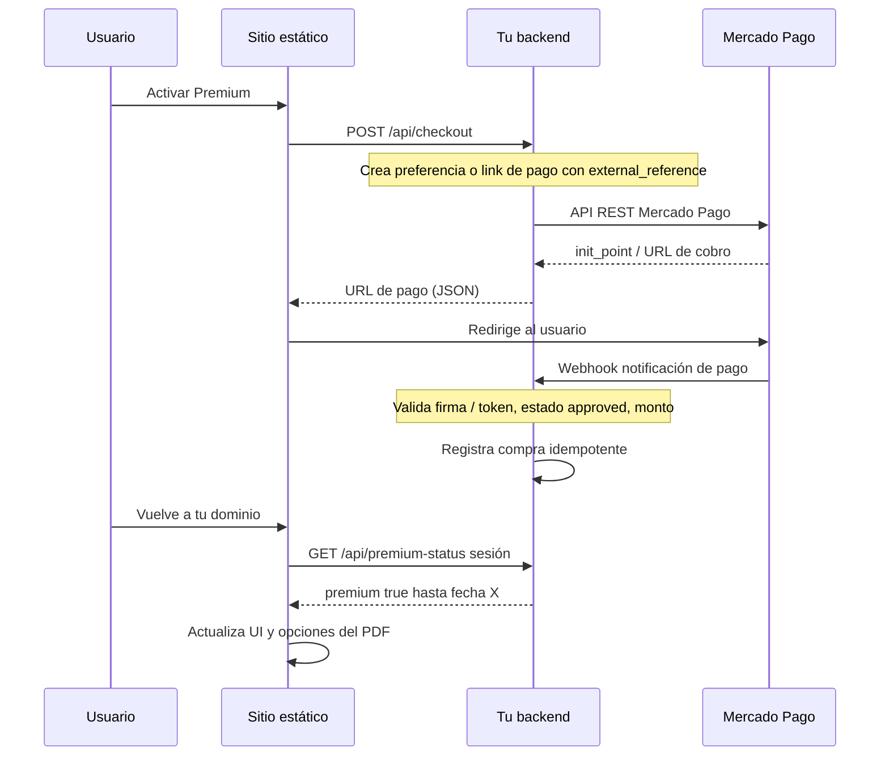

# CV Studio

Sitio estático para crear un currículum en el navegador, previsualizarlo y descargarlo en **PDF multipágina** (html2canvas + jsPDF). Incluye tres plantillas (Editorial, Corporativo, Minimal), borrador en **localStorage** y flujo **Premium** simulado con Mercado Pago (sin backend: confirmación manual en modal).

## Requisitos

Ninguno para producción: solo archivos estáticos. Para probar en local conviene Node.js (ver `npm start`).

## Uso en local

No hace falta `npm install`. Desde la carpeta del proyecto:

```bash
npm start
```

Abre `http://localhost:3000` (o el puerto que indique `serve`).

También puedes abrir `index.html` directamente; algunos navegadores restringen `file://` con APIs de archivos o CORS en imágenes del PDF. **Recomendado:** servidor local.

## Publicar en la web

### Netlify / Cloudflare Pages / Vercel (estático)

1. Sube la carpeta del proyecto (o conecta el repositorio Git).
2. Directorio de publicación: raíz del repo (donde está `index.html`).
3. Build command: vacío. Output: `.` o raíz.

### GitHub Pages

1. Repositorio en GitHub con estos archivos en la raíz (o en `/docs` si usas esa rama/carpeta).
2. Settings → Pages → Source: rama `main` y carpeta `/ (root)` o `/docs`.
3. Añade un archivo vacío `.nojekyll` en la raíz (ya incluido) para que no procese Jekyll archivos que empiecen por `_`.

Tras el despliegue, actualiza en `index.html` las meta **Open Graph** (`og:url`, `og:image`) y los archivos **`robots.txt`** y **`sitemap.xml`** (sustituye `TU-DOMINIO.com`). Si publicas en una **subruta** (p. ej. GitHub Pages `usuario.github.io/repo/`), ajusta también `start_url` en `site.webmanifest`.

## Qué personalizar antes de monetizar

| Qué | Dónde |
|-----|--------|
| Enlace de pago Mercado Pago | `script.js` → `MERCADOPAGO_URL` |
| Google AdSense u otra red | `index.html` → bloques comentados / enlaces de fallback |
| Textos legales (responsable, país, contacto) | `legal.html` |
| Marca / dominio / redes | `index.html` (footer, `site.webmanifest`) |

**Importante:** el Premium actual es **solo en el cliente**; cualquier usuario avanzado puede alterar `localStorage`. Para cobro verificable necesitas backend o la API de Mercado Pago con webhooks.

---

## Roadmap: Premium verificado + legal (producción seria)

Esta sección es una **guía de arquitectura** para cuando quieras dejar de depender del modal de confirmación y de `localStorage` como única prueba de pago.

### Por qué no basta el front actual

- El navegador lo controla el usuario: puede poner `localStorage.premium = "true"` sin pagar.
- Mercado Pago solo **garantiza** el cobro si tu sistema **recibe y valida** la notificación en un servidor que tú controlas (webhook o consulta server-side a la API de pagos).
- Cualquier flujo “pulso Sí después de pagar” sin backend es **UX simulada**, no facturación verificable.

### Flujo recomendado (alto nivel)



### Stacks razonables (elige uno)

| Opción | Ventaja | Nota |
|--------|---------|------|
| **Cloudflare Workers** + **KV** o **D1** | Muy barato, HTTPS global, buen encaje con webhooks | Límite CPU; diseña handlers ligeros |
| **Supabase** (Edge Functions + Postgres) | Auth opcional, tabla de compras, rápido de iterar | Revisa límites del plan gratuito |
| **Node** (Fastify / Express) en **Railway**, **Render**, **Fly.io** | Control total, mismo lenguaje que muchos equipos | Tú gestionas despliegue y secretos |

No hace falta microservicios: **un solo servicio** que exponga checkout + webhook + consulta de estado suele bastar.

### Endpoints sugeridos (contrato mínimo)

| Método | Ruta | Responsabilidad |
|--------|------|-----------------|
| `POST` | `/api/checkout` | Crea la **preferencia** o el flujo de pago en MP; devuelve `init_point` o URL. Incluye `external_reference` (p. ej. `userId` o UUID de sesión que luego enlazas a un email tras login). |
| `POST` | `/webhooks/mercadopago` | **Única fuente de verdad**: valida cabeceras/cuerpo según [documentación oficial](https://www.mercadopago.com.mx/developers/es/docs/your-integrations/notifications/webhooks), comprueba `status === approved`, monto y moneda, y registra la compra de forma **idempotente** (`payment_id` único en BD). |
| `GET` | `/api/premium-status` | Devuelve si el usuario (cookie **httpOnly** o JWT de corta duración) tiene premium activo y hasta qué fecha. |
| `POST` | `/api/auth/logout` | (Opcional) Invalida sesión. |

Reglas de oro del webhook:

1. **No** actives premium solo porque el usuario volvió a `success_url`.
2. **Sí** activa premium cuando el webhook (o una consulta server-side disparada tras webhook) confirma el pago.
3. **Idempotencia**: el mismo `payment.id` no debe insertar dos filas ni duplicar días de suscripción.
4. **Secretos** solo en variables de entorno del servidor, nunca en el repo ni en el front.

### Variables de entorno típicas

```env
MP_ACCESS_TOKEN=           # token de producción (servidor)
MP_WEBHOOK_SECRET=         # si MP lo ofrece para validar notificaciones
JWT_SECRET=                # firmar sesión del usuario tras login opcional
DATABASE_URL=              # Postgres / D1 / etc.
FRONTEND_URL=https://tudominio.com
```

Consulta siempre la **documentación vigente** de Mercado Pago para tu país (URLs de API, sandbox vs producción, cabeceras de validación).

### Enlaces útiles (México; cambia el país en la documentación si aplica)

- [Integraciones y credenciales](https://www.mercadopago.com.mx/developers/es/docs/your-integrations/credentials)
- [Checkout Pro / preferencias](https://www.mercadopago.com.mx/developers/es/docs/checkout-pro/landing)
- [Webhooks / notificaciones](https://www.mercadopago.com.mx/developers/es/docs/your-integrations/notifications/webhooks)
- [API de pagos (consultar un pago por ID)](https://www.mercadopago.com.mx/developers/es/reference/payments/_payments_id/get)

### Esquema de datos mínimo (ejemplo)

Tabla `purchases` (o `subscriptions`):

- `id` (uuid)
- `mp_payment_id` (unique, string)
- `amount`, `currency`
- `payer_email_hash` (nunca guardes email en claro si puedes evitarlo; o cifrado en reposo)
- `plan` (`premium_monthly`, etc.)
- `valid_from`, `valid_until` (o solo `valid_until`)
- `created_at`

Tabla `users` solo si más adelante añades cuentas; si no, puedes vincular por **magic link** al email del pagador validado por MP.

### Cambios en este repo (front) cuando tengas API

1. Sustituir `activarPremium()` para que llame a `POST /api/checkout` y redirija a la URL devuelta por tu backend (no hardcodear solo `mpago.la/...` si quieres trazabilidad por usuario).
2. Sustituir el modal “¿pagaste?” por: **polling** corto a `/api/premium-status`, o redirect con query firmada (`?checkout=ok&sid=...`) que el backend valide una sola vez.
3. Guardar en el cliente solo un **token de sesión** (idealmente en **cookie httpOnly** emitida por tu API en el mismo dominio o subdominio API) o JWT de corta vida; el flag `premium` en `localStorage` puede ser **caché** renovable, no la fuente de verdad.
4. CORS: permite en el backend solo `FRONTEND_URL`.

### Legal (checklist; no es asesoría legal)

Haz revisar por **abogado** según tu país y tipo de cliente (B2C UE tiene requisitos extra, p. ej. desistimiento en algunos bienes digitales).

- **Privacidad / cookies**: si usas AdSense, analítica o login, actualiza `legal.html` y un banner de cookies si aplica.
- **Condiciones de venta**: qué incluye Premium, duración, reembolsos, idioma y jurisdicción.
- **Pagos**: indicar que el cobro lo procesa **Mercado Pago** y enlazar a sus términos.
- **Propiedad del contenido**: el usuario es responsable del texto de su CV.

---

## Estructura

Incluye **`ENTREGA.md`** (memoria para el profesor: objetivos, stack, diagrama, limitaciones) y **`entrega.html`** (resumen con enlace al flujo de la app). En el pie del sitio hay enlace a la página de entrega.

```
index.html
styles.css
script.js
entrega.html
ENTREGA.md
legal.html
404.html
robots.txt
sitemap.xml
site.webmanifest
netlify.toml
assets/favicon.svg
package.json
README.md
.nojekyll
.gitignore
```

## Licencia

El código te pertenece al autor del repositorio; ajusta esta sección si publicas con licencia open source.
